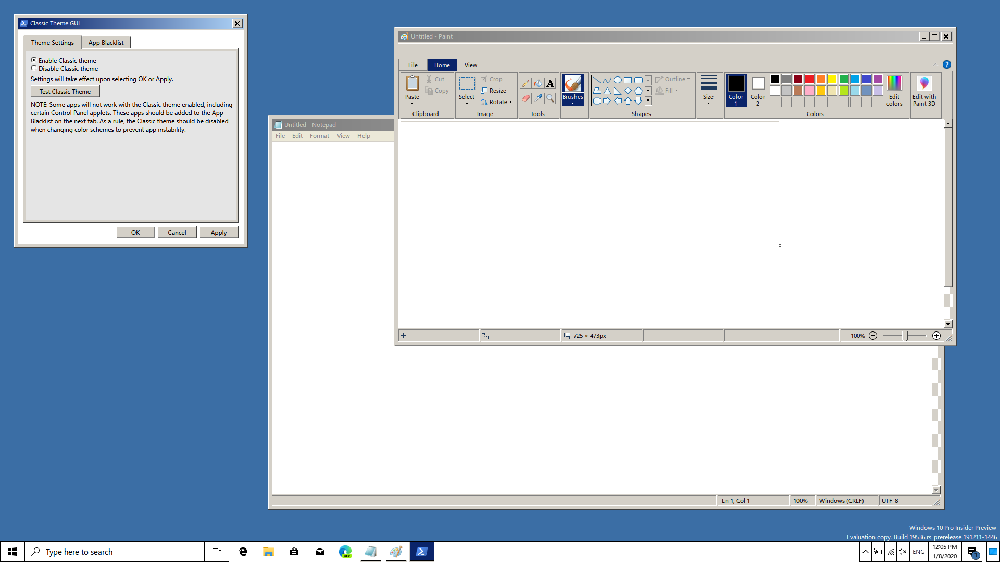
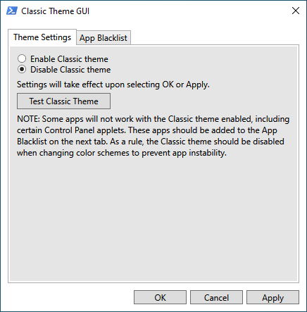
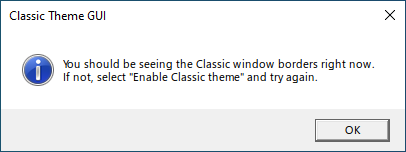
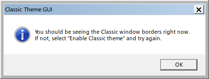
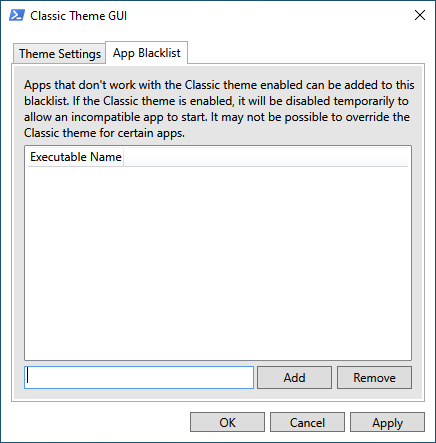
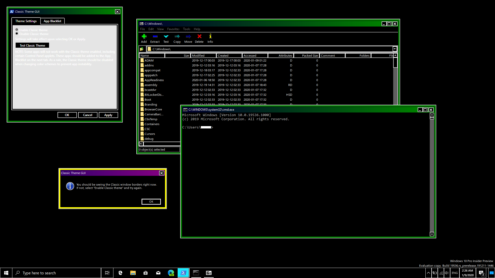

# Set-ClassicTheme

## A PowerShell script/graphical utility to enable the Classic theme in Windows 10.

## Background
Windows 7 was the last version of Windows to support the Classic theme/visual style. With the release of Windows 8, users could no longer apply the Classic theme. This was despite it being baked into the core of the Windows operating system, unlike Aero or other visual styles.

Eventually, methods and utilities to enable the Classic theme in Windows 8+ were developed. While these do enable the Classic theme, they do so in a rather crude manner, without any provisions for apps that don't work well, if at all, under the Classic theme. One such utility, [ClassicTheme.exe](https://forum.thinkpads.com/viewtopic.php?f=67&t=113024&hilit=Classic+theme+on+Windows+8), doesn't even allow you to switch back to your previous theme without a reboot!

With this in mind, I set about creating my own utility which would enable and disable the Classic theme in a safe manner, while also allowing apps to bypass the Classic theme if they need to do so. It would be scriptable to a large degree and provide a user-friendly interface as well. This is just what Set-ClassicTheme does.

## How it works
All Windows NT systems (or at least those since Windows XP) have a shared memory section called ThemeSection, located in \Sessions\&lt;Current Session ID&gt;\Windows\[1](#note1). ThemeSection governs whether apps in Windows can use visual styles; if an app cannot read or query ThemeSection upon launch, it will fall back to the Classic theme. We could do this by simply closing the memory handle, but it's better just to deny the current user read/query permissions[2](#note2), as that can be easily reversed.

In order to set the permissions for ThemeSection, we need to access the NT Object Manager. Rather than waste time trying to learn a new programming language like C++ or C#, I decided to write Set-ClassicTheme as a PowerShell script. PowerShell can interact with the Object Manager right out of the box, and supports the creation of WPF-based GUIs as well.

To enable the Classic theme, Set-ClassicTheme first finds the session ID for the current session. Then it generates a new security descriptor for the current user that denies read/query access, and applies it to ThemeSection. Since Set-ClassicTheme uses [SDDL](https://docs.microsoft.com/en-us/windows/win32/secauthz/security-descriptor-definition-language) internally, security descriptors are treated as strings, which can be manipulated using simple and familiar methods (IndexOf, Insert, Remove, etc.). To disable the Classic theme, Set-ClassicTheme simply finds where it inserted the permissions and deletes that portion of the string.

Since many of its functions require administrative privileges, Set-ClassicTheme is self-elevating. This means that if you try to run it under a normal user account, it will trigger a UAC prompt before continuing. This behavior should be taken into account when integrating Set-ClassicTheme into a scheduled task or similar.

It should also be noted that when the Classic theme is enabled or disabled, the settings only apply to new apps, not apps that were launched under the previous settings.

## Usage
Set-ClassicTheme.ps1 has five possible parameters: `-Enable`, `-Disable`, `-GUI`, `-FilePath`, and `-ArgumentList`. Running it without any parameters shows usage instructions, the equivalent of typing `Get-Help Set-ClassicTheme`.
### -Enable
Enables the Classic theme.
### -Disable
Disables the Classic theme.
### -GUI
Starts the Classic Theme GUI, which is described in its own section below.
### -FilePath
Specifies an app to run using PowerShell's `Start-Process`. If the Classic theme is enabled, it will be disabled temporarily while the app starts up, then immediately re-enabled. This is intended to run faulty apps that don't work with the Classic theme.
### -ArgumentList
Specifies arguments, or parameters, to pass to the app set in `-FilePath`. By default, `-ArgumentList` is set to a single space. This is because `Start-Process` won't allow an empty set of arguments, and I have yet to find a better solution for that.

## The Classic Theme GUI
When run with the `-GUI` option, Set-ClassicTheme starts the Classic Theme GUI, which is a WPF-based[4](#note4) graphical interface for setting up the Classic theme, as well as individual apps that won't run under the Classic theme. The Classic Theme GUI has been designed to look as close as possible to a normal Control Panel applet, as a default installation will place a link to it as "Classic Theme Settings" in Control Panel, under "Appearance and Personalization."
### Theme Settings

Here you can enable and disable the Classic theme by selecting the appropriate radio button, then "OK" or "Apply." You can also test the Classic theme by clicking the test button. This starts a new PowerShell job which opens a popup window that looks like this:

When you actually have the Classic theme enabled, it looks more like this:

### App Blacklist

Here you can specify apps which don't work under the Classic theme. Enter the name of the executable into the text box, then click "Add" to add it to the list. To remove an app, click on its name in the list, then "Remove."

When you click "OK" or "Apply," for each app added to the blacklist, Set-ClassicTheme will create a batch file under &lt;Installation Directory&gt;\Blacklist\ and a registry entry under HKEY_LOCAL_MACHINE\SOFTWARE\Microsoft\Windows\CurrentVersion\App Paths\ pointing to that batch file. It will also remove the registry aliases and batch files for apps which have been removed from the blacklist. The next time you attempt to run a blacklisted app, the batch file will run instead, intercepting the app launch through `Set-ClassicTheme -FilePath`.

## Applications
Since the Classic theme is rendered differently from other themes using visual styles (i.e. it doesn't have to pick out and draw visual style resources etc.), it can offer performance benefits on older hardware and in high-performance applications[5](#note5), such as graphics/video editing, industrial process controls, MRI scanners[6](#note6), and air traffic control towers[6](#note6). If you've been clinging onto Windows 7 because you like the Classic theme, you'll enjoy Set-ClassicTheme too. If you're currently using Windows 8.1 or Windows 10 with another Classic theme enabling utility, the improvements in usability will be a welcome change.

## Themes and color schemes
Since Microsoft removed the ability to directly apply the Classic visual style from Windows 8 onwards, its color scheme has been removed as well. The remaining High Contrast color schemes have been rewritten to use the Aero Lite visual style, a modified version of Aero that takes the same color parameters as Windows Classic. These will work fine with Set-ClassicTheme; they won't use aerolite.msstyles when the Classic theme is in effect[7](#note7).

You can also use [windows10-classic-themes](https://github.com/zkedem/windows10-classic-themes), which are the Classic color schemes from Windows XP that I have adapted for use with Windows 10. The screenshot at the top of this document actually shows one of the color schemes from windows10-classic-themes.

Regardless of what color schemes you choose, you should disable the Classic theme when switching between them; not doing so can wreck the entire Windows UI.

## Development
Set-ClassicTheme.ps1 was written using PowerShell ISE, which comes with Windows 10, though Visual Studio Code should work as well. The XAML for the Classic Theme GUI (MainWindow.xaml) was generated using Visual Studio 2019, then modified to work with PowerShell.

## To-do
I'm thinking of adding a third tab to the GUI with options like enabling the classic Task Manager from Windows 7, classic context menus, classic calculator, etc.

I've also been considering a desk.cpl-like feature that allows the user to preview the Classic theme and choose from different color schemes.

Any suggestions for improving the program's functionality, reliability, and features will always be welcome.

## License
Set-ClassicTheme is free software licensed under the GNU GPL.

## Footnotes
<a name="note1">1</a>. This is not a filesystem directory; much like UNIX is a file-based OS, Windows NT is object-based, and these objects have their own directory tree separate from C:\, D:\, etc.

<a name="note2">2</a>. Yes, Windows objects have permissions, just like files. You can set what each user can do with a given object.

<a name="note3">3</a>. Popup windows and error messages are actually handled using Wscript.Shell.

<a name="note4">4</a>. https://superuser.com/questions/289220/does-changing-windows-xp-theme-to-classic-enhance-performance

<a name="note5">5</a>. I'm not entirely sure on this one. If you or someone you know are involved in this line of work, let me know!

<a name="note6">6</a>. This screenshot and the one at the beginning might make it look like Set-ClassicTheme has to run in the foreground in order for the Classic theme to work, but that's not true. I included the Classic Theme GUI in the screenshots as an example of a feature in Set-ClassicTheme.